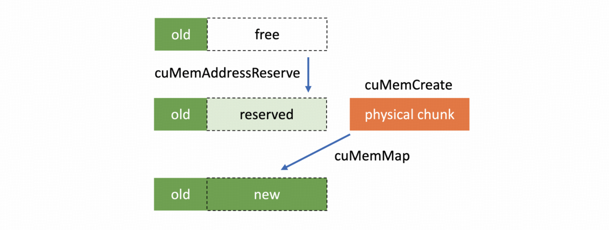

# v0.1.0: 重新定义高性能 RL 训练框架

> 本文首发于[知乎](https://zhuanlan.zhihu.com/p/1945237948166547268).

在社区的帮助下，我们在开源 2 个月后终于为 **slime** 打上了第一个版本号：**v0.1.0**。

用一句话来概括这个版本

> **slime v0.1.0 提供了大规模 MoE RL 训练所需的所有基本性能优化。**

具体来说，这个版本带来了以下改进：

- **性能**：
  - 提供了 **MoE 模型的高效推理**，特别是 fp8 rollout + deepep + mtp。
  - 设计了通用的**训练框架显存 offload 方案**，节省出更多 KV Cache 空间，从而提升推理并发度。
  - **更快的参数更新**。
  - 通过 **CPU Adam** 实现用更少的 GPU 也能进行更多训练。
  - 支持了 **Megatron 的全部并行策略**以及 deepep。
- **功能**：
  - 针对 MoE 模型训练支持了 **GSPO**。
  - 针对 fp8 rollout 支持了 **TIS**。
- **正确性**：
  - 加入了 **Dense 与 MoE 模型 CI**，严格检查 kl 等指标。

我们希望通过 slime v0.1.0 展示我们对高性能 RL 训练框架的理解，并有机会成为未来性能对比的基准（baseline）。

接下来，我将展开介绍上述功能背后的设计思路。

------

## 性能优化：提升 RL 训练速度上限

在传统的深度学习训练中，有一个万能的提速方案：**加卡**。通过降低每张卡上的计算数据，可以显著降低端到端的训练延迟。

然而，这个方法在 RL 训练中却行不通，因为**推理的延迟无法通过增加 GPU 来降低**。即使我们有再多的 GPU，也只能等待最长的样本解码（decode）结束。虽然可以通过增加吞吐量来提升每个 rollout 的训练数据量，但过大的推理 batch size 带来的 off-policy 问题目前来看仍有一些局限性。

我认为这是当前 RL 范式下对基础设施（Infra）的最大挑战，即：

> **我们希望 scale inference compute，但是我们无法 scale inference latency。**

单条数据的解码速度决定了 RL 训练速度的上限。对于较大的 MoE 模型，目前主要有以下 3 种常规优化方案来提升这一上限，我们也在每个方向上都做了尝试：

1. **通过量化来降低访存**：考虑到 RL 训练中不能进行长时间的 calibration，slime 选择进行 fp8 量化。
2. **使用 deepep low latency 模式来降低跨机 all2all 的时延**：为了配合 deepep，slime 推荐使用 fp8 的 blockwise 量化来开启 SGLang 的相关配置。
3. **开启投机采样（Speculative Sampling）**：slime 允许推理部分加载任意的 draft model（目前还不支持训练中更新 draft model）。

使用上述 3 种优化，我们可以将 **GLM4.5 355B-A32B** 这样的模型，从单条数据小于 10 token/s，提升至 **60~70 token/s**，从而极大提升 RL 训练速度的上限。

slime 也会在监控推理的吞吐之外，监控 `perf/longest_sample_tokens_per_sec`，从而更好地掌握推理部分的性能优化空间。

## 用更少的卡做更多的实验：充分 Offload Megatron

在对上限进行优化后，我们注意到 RL 训练的另外一个特性：只要 **KV Cache 不溢出**，推理 batch size 的提升并不会明显影响训练的延迟。

**KV Cache 溢出**指的是推理过程中，当数据的回复长度都很长时，KV Cache 空间不足，需要将某些生成到一半的数据先踢出队列，等其他数据推理完并腾出空间后，再重新进行 prefill 和后续的推理。如果一条回复长度为 64k 的数据在推理过程中等待了其他数据解码 32k token，相当于它的总时长对应了解码 96k token，这对 RL 训练速度影响很大。

因此，一个比较合适的训练配置是根据推理部分的 batch size、数据的平均回复长度和单个 server 能预留的 KV Cache 空间，计算一个在 KV Cache 不溢出情况下的最少 GPU 数量，并以这些 GPU 为一组进行训练。例如，我们有 512 张卡，计算出来 256 卡的 KV Cache 就已经充足，那么就应该并行运行 2 个实验，而不是用 512 卡一起启动实验。

基于这样的考量，我们注意到了 2 个优化点：

1. **最佳卡数可能不足以支持加载训练部分**。推理只需要加载 fp8 参数就够了，而训练一般需要 18 倍参数量以上的显存（bf16 param、fp32 grad、fp32 master param、fp32 m 和 v）。为了解决这个问题，slime 选择开启 **Megatron 自带的 CPU Adam** 来节省训练部分的显存。我们也是基于这样的策略提供了 8 节点训练 GLM 4.5 355B-A32B 以及 16 节点训练 DeepSeek R1 的方案。
2. **提升每个 SGLang Server 能预留的 KV Cache**，也就是开大 `--mem-fraction`。对于现在更为常见的训推一体的训练任务，限制 `mem_fraction` 的主要是将训练部分 offload 至 CPU 后的残留显存。因此，我们需要找到一个通用的方法，将 Megatron 部分占用的显存 offload 到 GPU。

### 如何通用地 Offload GPU Tensor

一个比较粗暴的方式是找到 Megatron 分配的所有 GPU Tensor，然后把它们全部 `.to("cpu")`。这种做法有 3 个难点：

- 很难捕获 Megatron 分配的全部 GPU Tensor。
- 由于 Megatron 的 distributed optimizer 会把所有参数重新整理到一些连续的 GPU Buffer 里，然后再通过各种 slice 划分出去，很难处理好所有的引用从而正确释放 GPU Tensor。
- Megatron 每次版本更新都要重新查一遍，不太好维护。

有没有一个更通用的方案呢？

我们注意到 SGLang 中的 `torch_memory_saver` 和 VLLM 中的 `cumem_allocator` 提供了一种较为通用的 offload 方案。它们的原理大致是，CUDA 10.2 提供了**一系列 Virtual Memory Management API**，类似于操作系统的虚拟地址与物理地址（VA 和 PA）。在分配显存时会返回一个显存映射的句柄（handle），而不是实际的物理地址。因此，我们在 offload 时只需要偷偷释放这个映射对应的显存，然后在需要这段显存时重新分配就可以了，上层的应用无需感知。

一个自然的想法就是用这个方式接管 RL 中训练部分的全流程。但是，这会导致无法复用 PyTorch 的 `CUDACachingAllocator`，没有缓存会导致显存碎片更明显，训练过程很容易 **OOM**。

为了能继续复用原生的带缓存的 allocator，我们不能使用 `CUDAPluggableAllocator` 了。再次注意到 slime 的架构中训练和推理是在不同进程的，所以我们只需要通过 `LD_PRELOAD` **直接替换训练进程中 `CUDACachingAllocator` 使用的 `cudaMalloc` 和 `cudaFree` 为 VMM API**。这样我们就可以完整且通用地 offload PyTorch 分配的所有 GPU Tensor。

同时，我们还要注意一个细节，那就是 VMM API 与 `cudaIPC API`（例如 `cudaIpcGetMemHandle`）是不匹配的。因此，对于训推一体的参数更新，或是 DeepEP，我们需要关闭 `LD_PRELOAD` 的替换，用回 `cudaMalloc`。

在 SGLang 社区的帮助下，我们针对 slime 的需求更新了 `torch_memory_saver`，实现了这个 offload 方案。

### 如何 Offload NCCL

在彻底 offload 了 Megatron 中的 GPU Tensor 后，我们发现还会有大量的显存残留，这是 **NCCL** 导致的。在 PyTorch 中，每个参与通信的 NCCL group 都会分配一份不小的 buffer。对于较大的 MoE 模型，由于引入了各种并行策略，这个问题尤为明显，可能会占到 **10GB 以上**。

上述 `LD_PRELOAD` 的方案不太好处理 NCCL 的问题，我们也不想去修改 NCCL 源码，以免在维护 slime 之余还要维护一个 NCCL fork。所以 slime 采用的方案是在 offload Megatron 的时候利用 `destroy_process_group` 来销毁 NCCL group，然后在 load Megatron 之前重建。为此，我们模仿 VMM API，对 `dist.new_group` 进行了 `monkey patch`，增加了一层 `ReloadableProcessGroup`。

这样，我们就实现了通用的 **NCCL offload**。不过，因为我们需要重建 NCCL group，这样的操作会对每轮训练的第一次通信速度有一定影响。但我们认为从可维护性以及节省的显存上，这个方案有很大的优势。

结合上述两项优化，我们将 Megatron 的残留显存从约 **15~18GB** 降低到了 **3~5GB**，从而将 MoE 模型的 `mem_fraction` 提升至 **0.7~0.8**，明显提升了预留的 KV Cache，提升了每个 server 能支持的并发度，实现了用更少的 GPU 启动更多的训练任务。

## 参数更新优化

参数更新是另外一个 RL 训练中特殊的环节。在这方面，slime v0.1.0 提供了训练推理在不同进程条件下的最佳优化方案。这部分工作由 Biao He 老师进行了大量优化，推荐阅读他的这篇博文：

- [高效强化学习训练 - 优化 slime 中的权重同步](https://hebiao064.github.io/rl-weight-sync)

目前 slime 可以做到 **48s** 完成训推一体下 GLM4.5 355B-A32B 模型 bf16 权重的参数同步，以及 **100s** 完成 fp8 blockwise 量化 + 参数更新（fp8 分支还在优化中）。

## 训练优化

对于 slime 的纯训练部分，我们认为 Megatron 已经提供了充足的优化，所以我们主要是**保证了对 Megatron 全部并行策略的适配**。

适配过程中有一个有趣的 bugfix：我们发现在 SGLang 开启 mtp 后，Megatron 部分无法启动 DeepEP。后来发现是因为在开启 mtp 时，SGLang 会 disable overlap schedule，导致在被 offload 到 CPU 后仍用 nccl 而非 gloo 进行某个 metadata 的通信，并与 DeepEP 产生了冲突。

## 性能优化 Check List

slime 发布以来，我经常被问到它与其他框架的性能对比。

我对基准测试（benchmark）的理解是，benchmark 不应该成为框架之间相互攻击的武器，而应该成为**查缺补漏的工具**。为此，我们会逐渐推出 slime 关注的性能 benchmark，用于自我提升。

同时，我也认为在跑分之前，可以从很多定性的角度来分析一个框架对性能的重视程度。这里提供一个基础优化的 feature check list：

- 是否支持 MoE 的训练？（目前大规模实验集中于 MoE）
- 是否支持内部的 sglang `mem_fraction` 或 vllm `gpu_utilization` 能调至 0.7 以上？（保证 KV Cache 空间）
- 是否支持 fp8 或更低精度量化的推理？（降低推理访存，提升速度）
- 是否支持训练和推理均开启 deepep？（优化 MoE all2all 通信）
- 是否支持投机采样？（提升推理时延与吞吐）
- 是否有高效的训练 backend，如 Megatron、torchtitan，并支持各项必要的并行？（复用成熟的训练优化）

slime v0.1.0 对上述的所有优化都进行了初步的尝试，当然提升空间依然很大。我们也希望这个版本能成为未来 slime 版本或者不同框架之间性能对比的基准。我们更欢迎所有在性能上和我们有相同追求的朋友来试用 slime，参与 slime 社区！

## 新算法支持

为了更好地训练 MoE 模型以及进行 fp8 rollout，我们实现了 **GSPO** 与 **TIS**。同时，社区的大佬也帮忙实现了例如 reinforce++、reinforce++ baseline 这样的算法。

## 正确性验证

slime v0.1.0 增加了**端到端 CI**：我们会对每个 PR 运行单机的 GLM4 9B 和 Qwen3 30B-A3B 训练，通过一些严格的检查来保证更新的正确性。例如，我们会明确要求：

- 第一个 rollout 的重算 log prob 和 reference model 的 log prob 完全相等。
- 每个 rollout 内的第一个训练步的 ppo_kl 严格为 0。

这样的精确验证是训练框架中很少能做到的，也是我们非常自豪的一点。

------

以上大致是 slime v0.1.0 的一个简单介绍，希望能让大家对 slime 产生一丝好奇，也希望 slime 能对大家的工作有所帮助。

欢迎大家都来参与 slime 社区，让我们共同建设开放的 RL Infra，一起为 RL scaling 添砖加瓦！