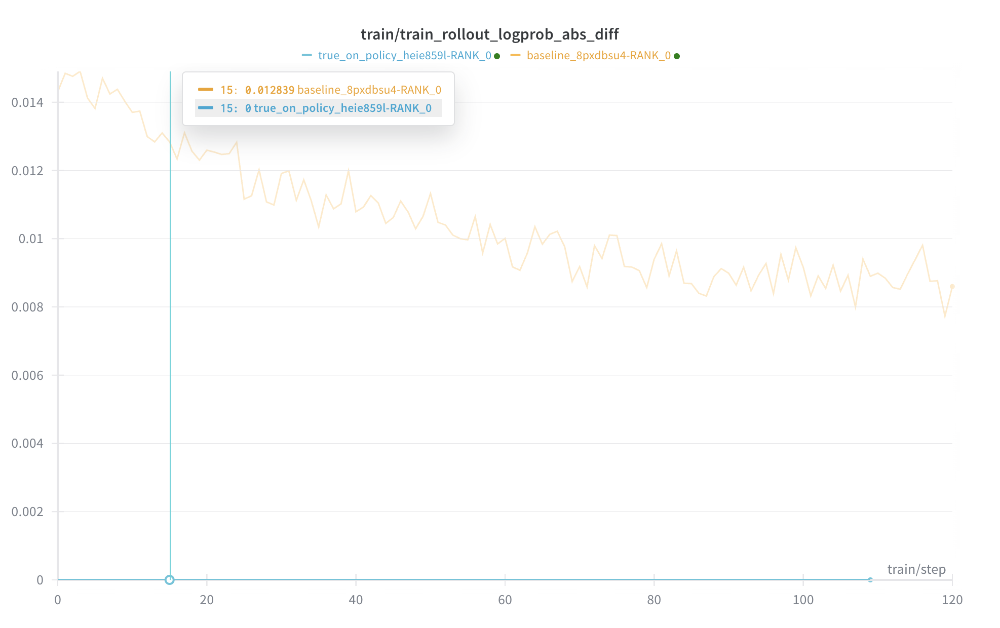
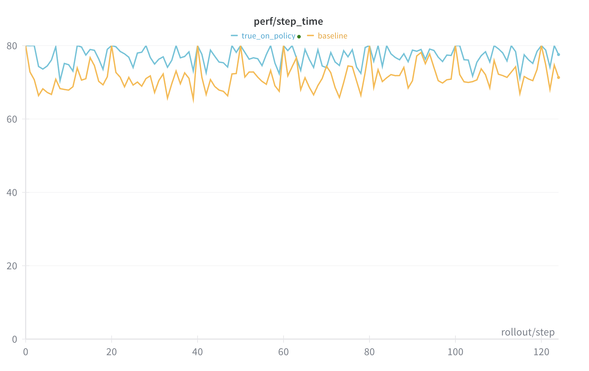
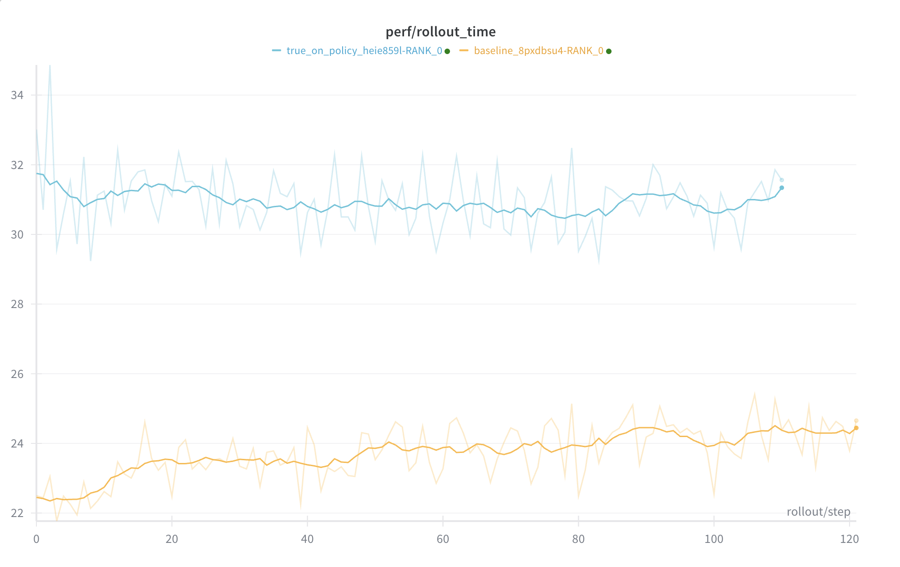
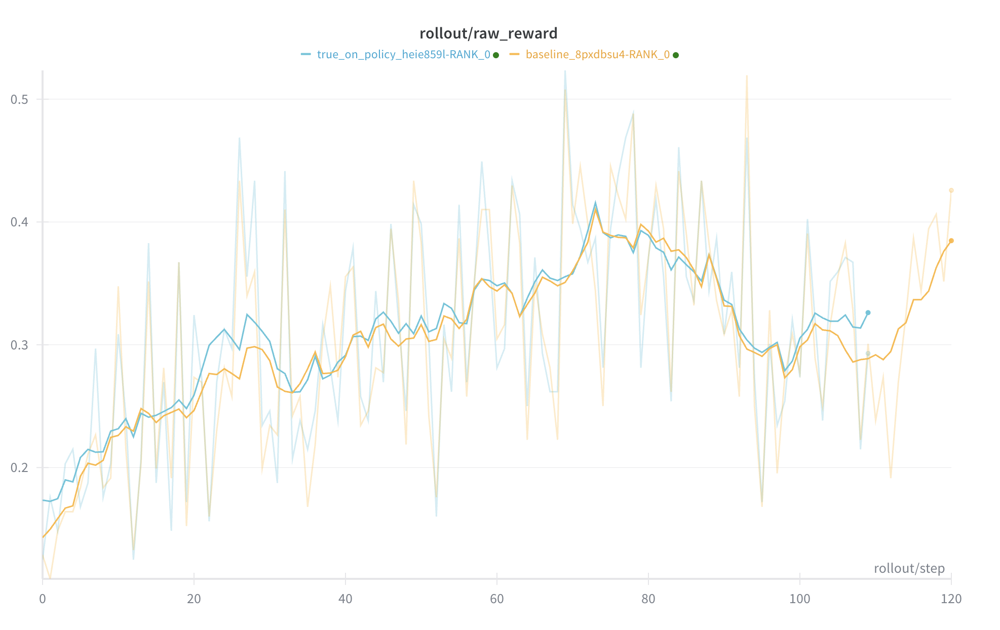
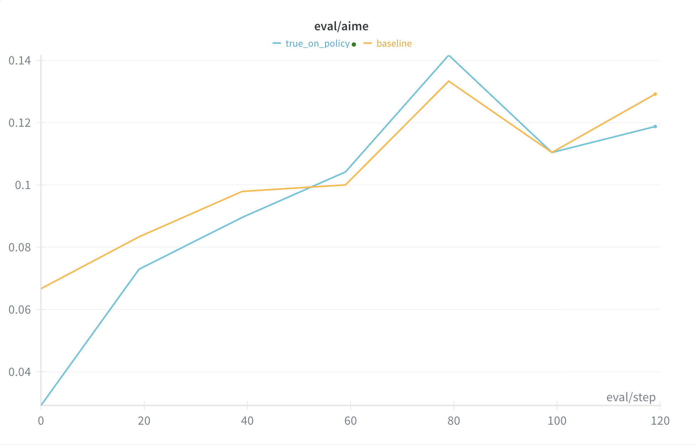

# True On-Policy between Training and Inference

True on-policy ensures that the log probs generated by inference engine (SGLang) is strictly equal to the one generated by the training Engine.

## Examples

### Example 1

In this script, we provide a minimal example to use true-on-policy.

```bash
python examples/true_on_policy/run_simple.py
```

### Example 2

This script contains more features for various use cases, and one flag is about the true on policy feature.

```bash
python scripts/run_qwen3_4b_fsdp.py --true-on-policy
```

In order to quickly see the curve, you may use `--mode debug_minimal`, which will skip evaluation and run generation with a very short output sequence length. Since true on policy is unrelated to OSL or answer correctness, this can be used for quick experiments.

### Other Cases

In order to support true on policy for other cases, please refer to the flags changed in the examples above.

### What is Expected to Observe

After running the training, you can see in wandb that the metric `train/train_rollout_logprob_abs_diff` should be exactly `0`. This indicates that there is no difference between the log probabilities from the training and the inference. Without the feature enabled, this value should be nonzero.

### Setup & Results
We fine-tune Qwen3-4B-Base on dapo-math-17k dataset with max_new_tokens = 2048, and evaluate on aime-2024 dataset with max_new_tokens = 8192.
Global batch size is 64 × 16. Results are summarized below.
<p align="center">      </p>

### Observations

Train–inference-diff is strictly 0, verifying full numerical equivalence between training and inference forward passes. Raw rewards perfectly match the baseline, and rollout time shows an acceptable slowdown.

### Reproduction

Detailed reproduction refers to [this](https://gist.github.com/fzyzcjy/46f9fc096258cf6fb4516ad2ffcefa8c).

## How it is Implemented

The core idea is to make each and every operation in training and inference be bitwise equal. The main code is implemented in [#566](https://github.com/THUDM/slime/pull/566) and [SGLang#12058](https://github.com/sgl-project/sglang/pull/12058).

Briefly speaking, we handled the following components to make them aligned:

* Attention: We use the [Flash Attention 3](https://github.com/Dao-AILab/flash-attention) backend for both training and inference, since it achieves bitwise equal between prefill and decode operations.
* GEMM: We use [DeepGEMM](https://github.com/deepseek-ai/DeepGEMM) for fast matrix multiplication while preserving true-on-policy, thanks to its algorithm to pick things like tensor core instructions ([SGLang#12142](https://github.com/sgl-project/sglang/pull/12142)).
* Batch invariant kernels: This is a prerequisite for true on-policy, and we use [the ones](https://github.com/thinking-machines-lab/batch_invariant_ops) from the Thinking Machines Lab.
* Torch compile: We also utilize [`torch.compile`](https://docs.pytorch.org/docs/stable/generated/torch.compile.html) to speed up by avoiding many tiny kernels.
* We align numeric operation details between the two systems for simplicity, such as op dtype, detailed kernels, etc. Some operations can also be compiled to speedup ([#603](https://github.com/THUDM/slime/pull/603), [SGLang#12161](https://github.com/sgl-project/sglang/pull/12161)).

In order to more easily align the two parts, we use SGLang's [dumper](https://github.com/sgl-project/sglang/blob/main/python/sglang/srt/debug_utils/dumper.py) tool for quick comparisons. (Need [#12622](https://github.com/sgl-project/sglang/pull/12622) and [#12623](https://github.com/sgl-project/sglang/pull/12623) for most convenience.)

## Future Works

We will keep maintaining and enhancing this feature. More specifically, we will:

* Further validate it with more experiments, and compare it with algorithmic fixes such as TIS.
* Potentially scale it to larger scale models if it is proven to be effective.
